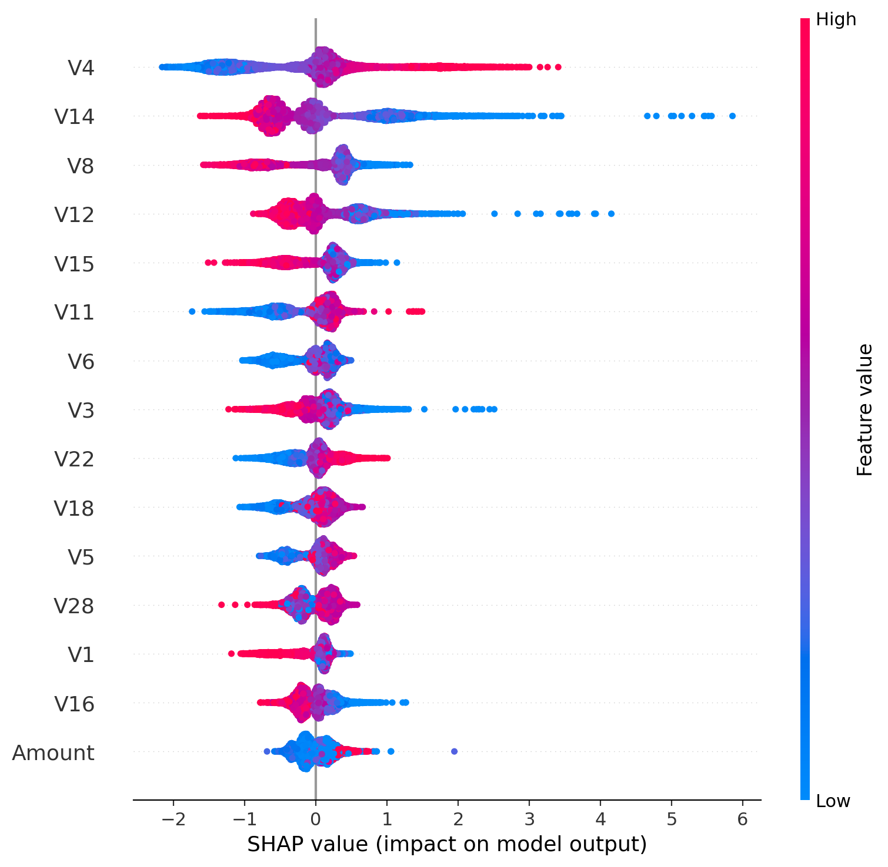
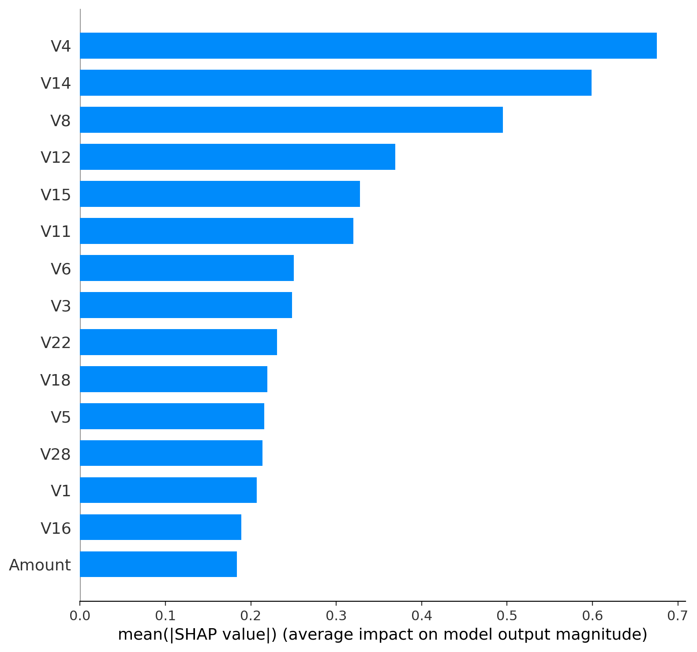

<!-- README for the Credit Card Fraud Detection System (Final Year Project) -->

# 💳 Credit Card Fraud Detection – Final Year Project

This repository contains the code, documentation and roadmap for a credit card fraud detection system developed as part of a final year thesis project. The goal is to design a production‑inspired solution that not only trains accurate machine learning models but also considers business requirements such as threshold policies, cost trade‑offs, model explainability and deployment readiness. The work follows a multi‑month roadmap (see below) and evolves from data exploration through modelling, refinement and deployment.

## 🧠 Why Fraud Detection Is Challenging

Credit card fraud detection is a rare‑event classification problem. In our dataset, only about **0.17 %** of transactions are fraudulent. This extreme class imbalance means that accuracy is not a useful metric: a naive model that labels everything as legitimate will achieve **>99 % accuracy** but catch **zero** frauds. What matters to businesses is the trade‑off between catching fraud (**recall**) and minimising false alarms (**precision**). False negatives (missed fraud) cause direct financial loss, whereas false positives (legitimate transactions flagged as fraud) irritate customers and increase operational costs. Consequently, we treat the model’s probability threshold as an operational policy to be tuned according to business costs instead of defaulting to 0.5.

## 📊 Dataset

We use the Kaggle Credit Card Fraud Detection dataset, which contains **284,807 transactions** recorded over two days with **31 anonymised features**. The features include principal components (**V1…V28**) derived via PCA, along with **Time** (seconds since the first transaction) and **Amount**. The target label **Class** indicates whether a transaction is fraudulent (1) or legitimate (0). Only **492** transactions are frauds, highlighting the need to handle class imbalance. The raw CSV file (**creditcard.csv**) is stored locally under `data/data_raw/` and is intentionally not committed to Git for privacy and licensing reasons.

### Key dataset considerations

- **Imbalance:** Fraud cases make up **<0.2 %** of the data, so special techniques (e.g. resampling, class weighting, cost‑sensitive learning) are required.
- **Anonymised features:** Most features are PCA components; interpreting them requires model explainability methods (SHAP/LIME) rather than domain knowledge.
- **Data cleaning:** The dataset is known to have no missing values, but we still verify this during exploratory analysis and scale/transform features as needed.

## 📅 Project Roadmap

The project follows a six‑month roadmap designed to build an industry‑ready fraud detection system. Each month has clear learning objectives, coding tasks and milestones extracted from the roadmap document. Below is a high‑level summary of what has been completed so far and what remains to be done.

### Month 1 – Foundations and Planning (completed)

- Learn Python & ML basics: Complete an introductory course in Python for data science and a beginner machine learning course.
- Project planning: Define the problem scope, understand class imbalance challenges, and set up the development environment (Python, Jupyter/VS Code, Git). Draft the introduction for the thesis report.
- Data acquisition: Obtain the Kaggle dataset and confirm access; write a short script to load it and compute the fraud rate to appreciate the imbalance.

### Month 2 – Data Understanding & Preprocessing (completed)

- Exploratory data analysis (EDA): Inspect distributions of each feature, particularly Amount and Time, and compare fraud vs non‑fraud distributions. Calculate and visualise the class imbalance and check for missing values.
- Feature engineering: Consider deriving useful features (e.g. hour of day from Time or threshold‑based flags) and note ideas for later use.
- Handling imbalance: Research and plan techniques like random oversampling/undersampling, SMOTE and cost‑sensitive learning to address the extreme imbalance.
- Reporting: Document the dataset characteristics, EDA findings and methodology plan in the report.

### Month 3 – Modelling & Business Selection (completed)

- Baseline models: Implement logistic regression and decision trees; evaluate using stratified train/validation/test splits. As expected, these simple models achieve high accuracy but low recall on fraud.
- Ensemble models: Train Random Forest and gradient‑boosted trees (XGBoost). Use cross‑validation, stratified splitting and cost‑sensitive parameters such as `scale_pos_weight`. Perform basic hyper‑parameter tuning.
- Threshold & policy tuning: For each model, sweep thresholds and optimise a cost‑based objective (e.g. `cost_fp=1`, `cost_fn=20`). Select thresholds on the validation set and apply to the test set.
- Shortlist & business decision: Compare models based on precision, recall, F1, ROC‑AUC and PR‑AUC. The shortlist currently favours XGBoost over Random Forest because it achieves similar recall but fewer false positives (see current snapshot below). Document this decision and its business interpretation.

### Month 4 – Refinement & Explainability (completed — Week 15 SHAP + Week 16 LIME & final threshold)

- Hyper‑parameter tuning: Systematically tune the best models (e.g. number of trees, depth, learning rate) using grid/random search on relevant metrics.
- Feature engineering: Revisit EDA findings to add or transform features where possible. Explore feature selection and possibly train an autoencoder for anomaly detection.
- Explainability: Integrate SHAP to compute global and local feature importances and identify which PCA components drive fraud predictions. Optionally apply LIME to explain individual predictions.
- Report updates: Expand the report with tuning results, feature engineering notes and explainability findings. Summarise the final model choice.

### Month 5 – Deployment & MLOps (planned)

- Model serialization: Save the final model to disk using joblib or a similar tool.
- REST API: Build a Flask/FastAPI service that loads the model and exposes a `/predict` endpoint. The API should accept transaction features, apply the same preprocessing as during training, and return the fraud probability and prediction.
- User interface: Optionally develop a simple web page or Streamlit dashboard for demo purposes.
- Containerization: Write a Dockerfile to package the API and its dependencies for consistent deployment. Test locally and, if feasible, deploy to a cloud service (e.g. AWS or Azure).
- Scalability & monitoring: Consider how the system could handle real‑time streams and large transaction volumes. Outline a future architecture using message queues and microservices.

### Month 6 – Finalization, Testing & Presentation (planned)

- Comprehensive testing: Validate the final model on a hold‑out test set and stress‑test the API with edge cases.
- Documentation: Finalise the thesis report with a cohesive narrative, executive summary, and professional formatting. Clean up code comments and write user‑friendly documentation.
- Presentation preparation: Create slides and a demo to showcase the business problem, modelling approach, results and the working API.
- Future work: Outline possible enhancements such as streaming simulations, ensemble stacking, model monitoring and advanced fraud techniques.

## ✅ Current Snapshot (Month 4 — Final)

The table below summarises the performance of our two leading models on the locked test set. During Month 4 we finalised **XGBoost** as the champion model and selected the final operating threshold on the **validation set** using a **precision constraint policy (precision ≥ 0.80)**, then reported results once on the **locked test set**.

| Model | Threshold policy | Selected on | Threshold | Precision (Fraud) | Recall (Fraud) | F1 | F2 | MCC | ROC‑AUC | PR‑AUC | TP | FP | FN |
|---|---|---|---:|---:|---:|---:|---:|---:|---:|---:|---:|---:|---:|
| Random Forest | cost‑optimal | validation | 0.2354 | 0.7549 | 0.8105 | 0.7817 | 0.7987 | 0.7815 | 0.9719 | 0.8061 | 77 | 25 | 18 |
| **XGBoost (Champion)** | **precision ≥ 0.80 (final)** | **validation** | **0.1279** | **0.8280** | **0.8105** | **0.8191** | **0.8140** | **0.8189** | **0.9699** | **0.8171** | **77** | **16** | **18** |

**Business interpretation:** XGBoost captures **77** frauds and misses **18**, while keeping false alarms low (**16** false positives on ~56k legitimate transactions). Compared with cost‑based thresholding, the precision‑constraint policy reduces analyst workload and customer friction without reducing fraud capture.

---

|---|---:|---:|---:|---:|---:|---:|---:|---:|---:|
| Random Forest | cost‑optimal (val‑selected) | 0.2354 | 0.7549 | 0.8105 | 0.7817 | 0.9719 | 0.8061 | 77 | 25 | 18 |
| XGBoost | cost‑optimal (val‑selected) | 0.0884 | 0.7938 | 0.8105 | 0.8021 | 0.9699 | 0.8171 | 77 | 20 | 18 |

**Business interpretation:** Both models capture the same number of frauds (77) and miss 18, but XGBoost produces fewer false alarms, reducing analyst workload and customer friction. A recall‑target policy can achieve slightly higher recall but results in thousands of false positives, which is operationally unacceptable. Thus, we select XGBoost as the current champion model.

---

## 🔍 Explainability (Week 15 — SHAP)

To make the champion model auditable and “responsible”, Week 15 applies **SHAP TreeExplainer** to the final XGBoost model and produces both **global** and **local** explanations.

**Where to find the outputs**
- Weekly write‑up: `reports/15_week15_shap_explainability.md`
- Report snippet (copy‑paste): `reports/report_snippets/week15_shap.md`
- Figures: `reports/figures/week15/`
- Metadata: `reports/week15_shap/`

**Key SHAP deliverables**
- Global: beeswarm summary + mean(|SHAP|) bar
- Dependence plots: top‑2 drivers (this run: V4 and V14)
- Local case studies: True Positive, True Negative, Borderline near threshold **0.0884**

<details>
<summary><b>Visual preview (click to expand)</b></summary>

**Global summary (beeswarm)**  


**Global importance (mean |SHAP| bar)**  


</details>


## 🔎 Explainability (Week 16 — LIME + Final Thresholding)

Week 16 completes Month 4 by adding **LIME Tabular** (model‑agnostic) local explanations for the same three case studies used in SHAP (TP/TN/Borderline), and by finalising the **operating threshold policy** on the validation set.

**Where to find the outputs**
- Weekly write‑up: `reports/16_week16_lime_thresholding_deployment.md`
- LIME report snippet: `reports/report_snippets/week16_lime.md`
- LIME figures: `reports/figures/week16/` (e.g., `lime_idx18427.png`, `lime_idx49260.png`, `lime_idx53293.png`)
- LIME metadata: `reports/week16_lime/` (`lime_explanations.json`, `lime_top_features.csv`, `lime_config.json`)

**Final thresholding (Week 16)**
- Script: `src/16_thresholding_and_metrics.py`
- Policies evaluated: `cost_based`, `max_f1`, `max_fbeta (β=2)`, `precision_constraint`
- **Final policy locked:** `precision_constraint_p80` (precision ≥ 0.80) → **thr ≈ 0.1279** (selected on validation, reported on locked test)

**Deployment readiness narrative**
- Report snippet: `reports/report_snippets/week16_final_model_and_deployment.md`
- Deliverables + milestone closure: `reports/report_snippets/week16_deliverables_and_milestone.md`


## 🧰 Technology Stack

- **Programming language:** Python 3.13
- **Data analysis & modelling:** pandas, numpy, scikit‑learn (LogReg, Decision Tree, Random Forest), XGBoost
- **Visualisation:** matplotlib (ROC/PR curves, confusion matrices, threshold sweeps), SHAP (global & local explainability)
- **Development environment:** Jupyter notebooks, VS Code
- **Deployment:** Flask or FastAPI (planned), Docker (planned)

### Artifacts generated during runs include

- `metrics.json` – summary of evaluation metrics for each model
- `threshold_sweep_*.csv` – threshold vs cost/metrics table
- `classification_report_*.txt` – detailed classification reports
- **Plots (PNG)** – ROC curves, precision‑recall curves, cost‑vs‑threshold graphs and confusion matrices

- `shap_mean_abs.csv` – global feature importance (mean |SHAP|)
- `shap_cases.json` – selected TP/TN/borderline cases + operating threshold
- **SHAP plots (PNG)** – beeswarm summary, mean |SHAP| bar, dependence plots, and local waterfall plots
## ⚡ Getting Started

### 1. Clone the repository and set up a virtual environment

```bash
git clone https://github.com/LazarosVoulistiotis/cc-fraud-detection.git
cd cc-fraud-detection
python -m venv .venv
source .venv/bin/activate  # On Windows: .venv\Scripts\activate
pip install -r requirements.txt
```

### 2. Obtain the dataset

Download `creditcard.csv` from Kaggle’s Credit Card Fraud Detection page and place it in `data/data_raw/`. This file is not provided in the repository due to licensing.

### 3. Create stratified splits

Run the splitting script to generate train/validation/test CSVs:

```bash
python src/08_2_make_splits.py \
  --data data/data_raw/creditcard.csv \
  --outdir data/data_interim \
  --target Class \
  --test-size 0.20 \
  --val-size 0.10 \
  --seed 42 \
  --drop-duplicates
```

### 4. Train and evaluate models

Example commands are provided for each model in the `src/` directory. See the quickstart examples at the top of each training script for details. Each script saves metrics, threshold sweeps and plots to `reports/` and `reports/figures/`.


### 5. Run explainability (Week 15 — SHAP)

After training the champion model, generate SHAP plots for the report:

```bash
python src/15_shap_explainability.py \
  --model-path models/xgb_week8.joblib \
  --data-train data/data_interim/splits_week8/train.csv \
  --data-test  data/data_interim/splits_week8/test.csv \
  --target-column Class \
  --figdir reports/figures/week15 \
  --outdir reports/week15_shap \
  --sample-size 10000 \
  --background-size 1000 \
  --threshold 0.0884 \
  --seed 42
```

Outputs:
- Figures: `reports/figures/week15/`
- Metadata: `reports/week15_shap/shap_mean_abs.csv`, `reports/week15_shap/shap_cases.json`


### 6. Run explainability (Week 16 — LIME)

Generate model‑agnostic local explanations for the same TP/TN/Borderline cases used in SHAP:

```bash
python src/16_lime_explainability.py   --model-path models/xgb_week8.joblib   --data-train data/data_interim/splits_week8/train.csv   --data-test  data/data_interim/splits_week8/test.csv   --target-column Class   --shap-cases reports/week15_shap/shap_cases.json   --figdir reports/figures/week16   --outdir reports/week16_lime   --threshold 0.0884   --num-features 10   --num-samples 5000   --seed 42
```

### 7. Final thresholding & metrics (Week 16 — VAL-selected, TEST locked)

Select the operating threshold on the **validation set** and evaluate once on the **locked test set**:

```bash
python src/16_thresholding_and_metrics.py   --model-path models/xgb_week8.joblib   --data-train data/data_interim/splits_week8/train.csv   --data-val   data/data_interim/splits_week8/val.csv   --data-test  data/data_interim/splits_week8/test.csv   --target-column Class   --policy precision_constraint --precision-min 0.80   --figdir reports/figures/week16/precision_constraint_p80   --outdir reports/week16_thresholding/precision_constraint_p80   --seed 42
```

Outputs:
- Figures: `reports/figures/week16/precision_constraint_p80/`
- Metrics + sweeps: `reports/week16_thresholding/precision_constraint_p80/`


### 6. (Coming soon) Run the API

Once Month 5 tasks are complete, a Flask/FastAPI app will be added under `src/api/`. Instructions for starting the server and sending requests will be documented here.

## 🗂️ Project Structure (high level)

- `src/` — training, evaluation, and utility scripts (week-based)
- `models/` — saved models (`*.joblib`)
- `data/` — raw/interim/working datasets (raw data excluded from GitHub)
- `reports/` — weekly markdown reports + run artifacts (metrics, sweeps, summaries)
- `reports/figures/` — plots ready to embed in the thesis report

## 🧾 Integration with the Thesis Report

This repository is structured to support report writing. Under `reports/` you will find month‑by‑month folders containing notes, figures and report snippets. For instance:

- `reports/month1/` – introductory notes on the problem and dataset
- `reports/month2/` – EDA, scaling experiments and imbalance analysis
- `reports/month3/` – modelling results and business selection narrative
- `reports/report_snippets/` – ready‑to‑paste paragraphs used in the thesis

In the later months the report will include sections on hyper‑parameter tuning, feature engineering, explainability, deployment architecture and final conclusions.

## 👤 Author

Lazaros Voulistiotis – final year Computer Science student, aspiring Machine Learning Engineer.

If you find this project useful or have suggestions, feel free to open an issue or contact me. Contributions are welcome!

## 🔮 Future Work

The roadmap extends beyond the initial six months. Possible stretch goals include:

- Streaming simulation: Feed transactions to the API in real time and monitor detection latency.
- Ensemble stacking: Combine multiple models (e.g. Random Forest and XGBoost) in a voting or stacking ensemble.
- Model monitoring & drift detection: Plan mechanisms to detect changes in fraud patterns and trigger model retraining.
- Graph‑based fraud detection: Explore graph algorithms to identify fraud rings and relational anomalies.

By systematically following this roadmap and integrating best practices in machine learning and MLOps, this project aims to deliver a credible, real‑world‑ready fraud detection solution that can be showcased to both academic evaluators and industry recruiters.
