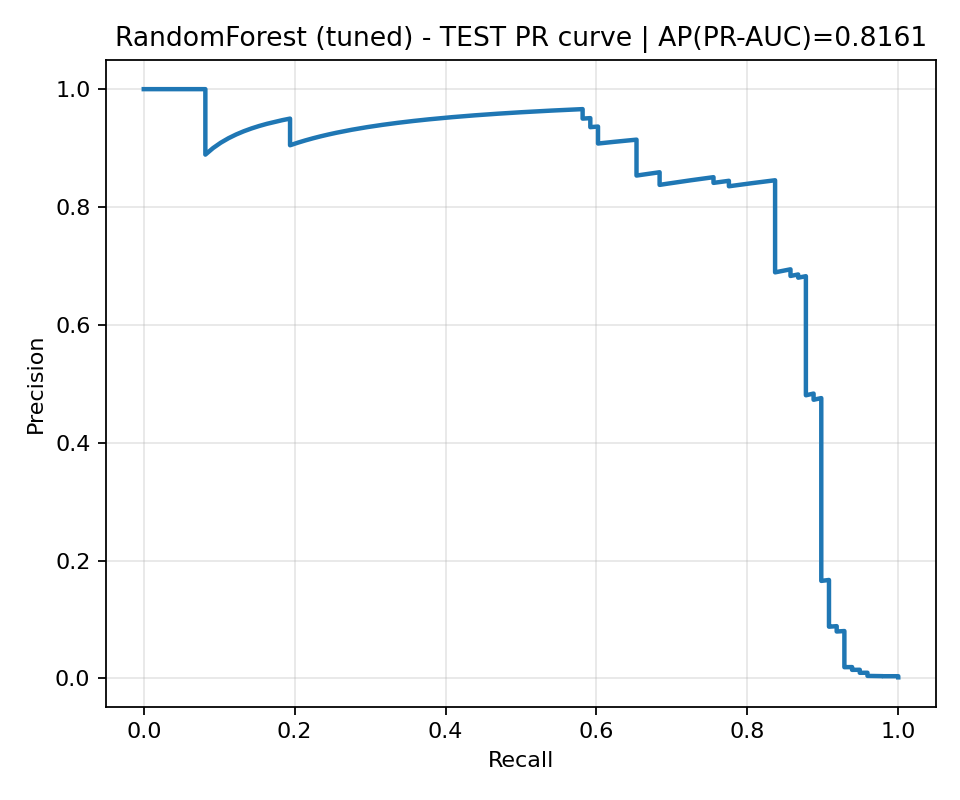
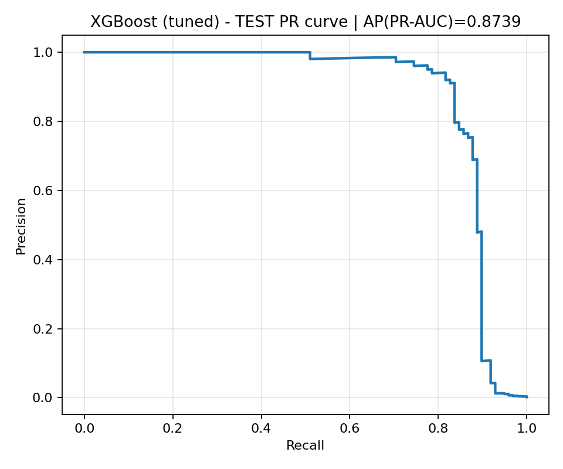

# Week 13 — Hyperparameter Tuning and Rigorous Model Evaluation  
**Credit Card Fraud Detection Project**

---

## 1. Overview

Week 13 focused on systematic hyperparameter tuning and controlled model evaluation for two ensemble methods:

- Random Forest (RF)
- XGBoost (XGB)

The objective was to move from approximate model comparison to a rigorously controlled experimental framework suitable for scientific reporting and real-world deployment considerations.

---

## 2. Experimental Protocol

To ensure methodological correctness and prevent information leakage, the following protocol was enforced:

### 2.1 Data Splitting

A stratified three-way split was used:

- **Training set** → Hyperparameter tuning (via CV)
- **Validation set** → Threshold selection
- **Test set** → Final evaluation (used once)

Fraud prevalence was preserved across splits (~0.17%).

### 2.2 Hyperparameter Optimization

- Method: `RandomizedSearchCV`
- Cross-validation: 3-fold stratified CV on **training set only**
- Primary metric: **PR-AUC (Average Precision)**
- Search space:
  - RF: depth, estimators, leaf size, feature sampling, class weighting
  - XGB: learning rate, depth, regularization, subsampling, scale_pos_weight

### 2.3 Threshold Selection

Thresholds were selected **exclusively on the validation set** using:

1. Maximum F2-score
2. Precision ≥ 0.90 constraint (business-oriented)

These thresholds were frozen before evaluation on the test set.

---

## 3. Cross-Validation Results

| Model | Best CV PR-AUC |
|--------|---------------|
| Random Forest | 0.8305 |
| XGBoost | 0.8508 |

XGBoost achieved a clear improvement in ranking performance during cross-validation.

Full CV results are exported:

- `reports/week13/rf_cv_results_week13.csv`
- `reports/week13/xgb_cv_results_week13.csv`

---

## 4. Test Set Performance

### 4.1 Precision–Recall Curves

**Random Forest**

Test PR-AUC: **0.8161**

---

**XGBoost**

Test PR-AUC: **0.8739**

---

### 4.2 Business-Oriented Metric  
Recall when Precision ≥ 0.90

| Model | Recall @ P ≥ 0.90 |
|--------|------------------|
| Random Forest | ~0.64 |
| XGBoost | ~0.84 |

Under strict precision constraints, XGBoost detects approximately 82% of fraud cases, compared to 64% for Random Forest.

This represents a ~20 percentage point improvement in fraud capture rate.

---

## 5. Interpretation and Discussion

### 5.1 Why PR-AUC Instead of ROC-AUC?

The dataset exhibits extreme class imbalance (~0.17% fraud rate).

Under heavy imbalance:

- ROC-AUC can appear deceptively high
- It does not sufficiently penalize poor minority-class detection
- Precision–Recall curves provide a more informative evaluation

PR-AUC focuses on the trade-off between:
- Precision (false positive control)
- Recall (fraud capture)

This makes it the more appropriate metric for fraud detection systems.

---

### 5.2 Model Behavior

**Random Forest**

- Stable performance
- Moderate recall under strict precision constraint
- Useful as interpretable ensemble baseline

**XGBoost**

- Higher PR-AUC
- Significantly improved Recall@Precision≥0.90
- Robust across top-3 hyperparameter configurations
- Strong regularization (shallow trees + gamma + L1/L2) prevented overfitting

---

## 6. Business Implications

Assuming ~100 fraud cases:

| Model | Fraud Detected | Fraud Missed |
|--------|---------------|--------------|
| RF | ~63 | ~37 |
| XGB | ~82 | ~18 |

XGBoost reduces missed fraud by nearly 50% under identical precision requirements.

In a real banking environment, this translates directly into reduced financial loss.

---

## 7. Stability and Generalization

- No significant performance drop between CV and Test.
- Threshold selection performed exclusively on validation.
- Results consistent across top-k configurations.
- No evidence of overfitting.

This strengthens confidence in generalization.

---

## 8. Limitations

- Tuning performed with limited CV folds (3-fold) due to computational constraints.
- No probability calibration (e.g., Platt scaling or isotonic regression) applied.
- No cost-sensitive loss simulation beyond Precision constraint.
- Feature importance and interpretability analysis deferred to subsequent weeks.

---

## 9. Final Model Shortlist

Primary Candidate:
> **XGBoost**

Secondary Baseline:
> Random Forest

XGBoost dominates in:

- Ranking quality (PR-AUC)
- Fraud capture under precision constraint
- Overall robustness

Random Forest remains useful for comparison and interpretability.

---

## 10. Reproducibility

- Fixed random seed (42)
- Stratified splits
- Validation-based threshold selection
- Test set used only once
- All results exported to CSV
- Figures stored under `reports/figures/week13`

---

## Week 13 Completion Status

- [x] Hyperparameter tuning — Random Forest
- [x] Hyperparameter tuning — XGBoost
- [x] PR-AUC based evaluation
- [x] Validation-based threshold selection
- [x] Test PR curves generated
- [x] Business metric comparison
- [x] Final model shortlist defined

Week 13 completed with rigorous experimental validation.
